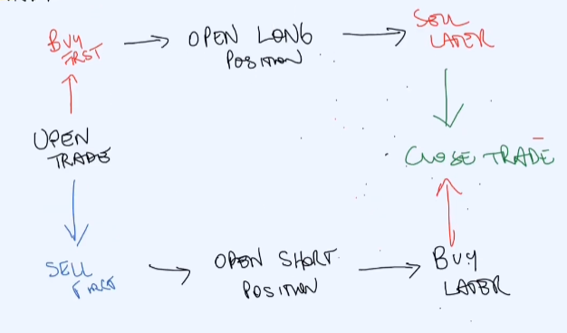
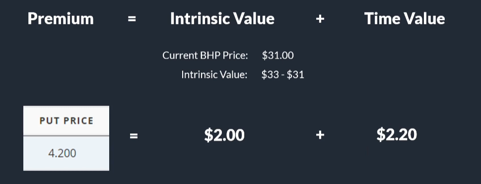
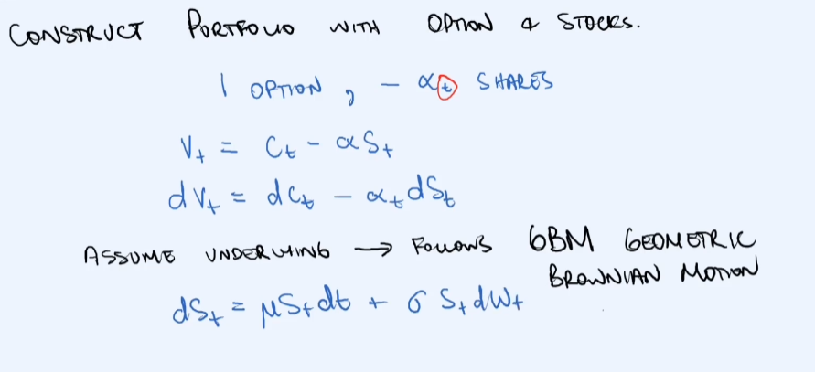

# Quant Finance Projects

## Options

An option is a contract which gives the buyer the right, but not the obligation, to buy or sell an underlying asset or instrument at a specified strike price prior to or on a specified date.

1. **It's an agreement**
- To MAYBE buy/sell
- At a given PRICE
- At a specified TIME

2. **A premium is paid**
- The seller requires a premium for the flexibility of this agreement.

#### Example: Buying a house

Imagine we want to buy a house, and the seller want $500,000 AUD. As a buyer we have the following options:

1. **Spot/Cash Transaction**: Agree on terms and exchange money for goods.
2. **Forward Contract**: An agreement to buy the house in 1 year for $500,000
3. **Option Contract**: The option to buy the house in 1 year for $500,000. Will have to pay $20,000 now for the contract.

#### Why do you want to use Options?

1. **Hedge Risk**: If you have purchased 100 BHP shares today, how do you protect yourself against potential losses.

2. **Speculation**: Bet on market moves in direaction or volatility.

### Contracts & Terms

An option is like an insurance product. The option contract terms are the following:

1. **Premium**: This is paid to buy the actual options contract, and is negotiated between the buyer and seller. 
2. **Expiration Date**: When the option becomes invalid, i.e., how long we are able to realize the option.
3. **Strike (Exercise Price)**: How much as a buyer you are is willing to pay for the option at that given time.
4. **Underlying**: The contract's price is very linked to the 'events' that we are trying to price it one, i.e., for an insurance product, the insurarer is likely to charge more if is i higher probability of the house burning down.
5. **Contract Type (Calls or Puts)**: For a call, we buy the product at a given exercise price. For puts, we sell the product at a given exercise price.

### Option: Call Vs. Put

#### Option Call

It is the right to buy, not an obligation, the underlying asset at specified price at a time in the future. So ideally, if the price has gone up at the time we reach the defined time step from initial price, we could realize our option to buy. If the price has gone down, we can just let the option expire.

#### Option Put

It is the right to sell at a given price and a given time in the future, not an obligation to exercise this. So for example, if we buy an put option to sell the underlying asset at $40, and at the expiration date the underlying asset is valued at $30, we gain $10 as we sell for a higher value compared to the current market value.

#### Trading - Buying & Selling

In the image, we see different strategies for trading, if we either decide to **Buy First**, we open a long position, or we **Sell First**, we open a short position.

If we buy a **call option**, then we are hoping that the underlying asset will increase in value so that we can buy the underlying asset at a discount (the strike price being below the current share price). On the flip side, the person who has sold the call option, is hoping that they do not need to pay out on this position, i.e., the Share Price minus the Strike Price (S-K).

Now for a **put option**, the buyer is hoping that the share price will go down so that they can sell at a greater value. The person who sold the put, they would need to pay out the difference between the strike price and the current price of the underlying asset (K-S).

### Underlying & Contract Multiplier

An underlying is a security/commodity to be bought or sold under the terms of the contract. Examples of an options underlying asset:

1. **Shares**
2. **Futures (Future Contracts)**: These could be quartelry options, yielding their underlying Quarterly Futures.
3. **Anything**: Example of this could be a House.

#### Contract Multiplier

Purchasing options on exchange-traded products have a specific quantity of underlying per contract. In other words, an exchange-traded option has a number of underlying that the contract controls, and this is termed the **contract multiplier**.

### Strike Price & Expiration Date

1. **Strike/Exercise Price**: The price at which the underlying will be delivered, should the holder of an option choose the exercise his right to buy/sell.
2. **Expiration Date**: The date on which the owner of an option must make final decision to buy, in case of a call, or sell in case of a put.

### Options Premium

Optiums premium is based of Supply & Demand, i.e., the price at which a willing buyer and sellet transact an options contract.

There are **two main components** of options premium:

$Premium = Intrinsic Value + Time Value$

The **Intrinsic Value** is based of the price right now, i.e., the amount of value in the optionality right now (as if you exercised the option today).

Whereas, the **Time Value** is the price uncertainty, i.e., the amount of possible future value of the underlying asset. The Time Value incorporates the future uncertainty and volatility of the underlying asset. We can see below how we calculate the Intrinsic Value & Time Value based on a premium:

### Option Settlement & Exercise Style

For a call, if the buyer decides to exercise the call option at the Strike Price which they have purchased, the original seller of the option is **Assigned the call**, and is required to sell the underlying asset at the defined Strike Price. If the buyer does not decide to exercise the call option, the seller keeps the premium which was paid initially to get the call option.

#### Exercise Style

A **European Contract** can only be exercised at the Expiration date set in the contract. Whereas, an **American Contract** can be exercised anytime between now and the Expiration date.

## How to Value Options using the Black-Scholes PDE

#### Assumptions

The following assumptions also form what we call the **Ideal Market Condition**.

1. **Short Term Interest Rates are Constant**
2. **Stocks Pay No Dividends**
3. **No Transaction Costs** (i.e., like brokerage)
4. **Can Borrow a Fraction of the Stock**
5. **Short Selling Allowned**

#### Method Overview

1. Price Derivative using Replication.
2. Construct Risk Free Portfolio.
3. $C_t = C(S, t)$ is a Smooth Function for all $C$. We can then use Ito's rule to express portfolio drift as $C$'s partial derivatives.
4. Find $C(S, t)$ that satisfies the PDE.

The **Geometric Brownian Motion (GBM)** has a drift term ($dt$) and a diffusion term ($dW_t$).

