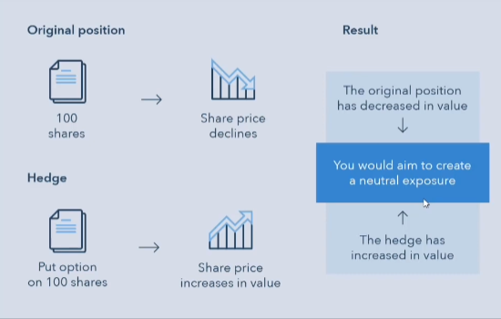

# Quant Finance Projects

## Options

An option is a contract which gives the buyer the right, but not the obligation, to buy or sell an underlying asset or instrument at a specified strike price prior to or on a specified date.

1. **It's an agreement**
- To MAYBE buy/sell
- At a given PRICE
- At a specified TIME

2. **A premium is paid**
- The seller requires a premium for the flexibility of this agreement.

#### Example: Buying a house

Imagine we want to buy a house, and the seller want $500,000 AUD. As a buyer we have the following options:

1. **Spot/Cash Transaction**

Agree on terms and exchange money for goods.

2. **Forward Contract**

An agreement to buy the house in 1 year for $500,000

3. **Option Contract**

The option to buy the house in 1 year for $500,000. Will have to pay $20,000 now for the contract.

#### Why do you want to use Options?

1. **Hedge Risk**

If you have purchased 100 BHP shares today, how do you protect yourself against potential losses.

2. **Speculation**

Bet on market moves in direaction or volatility.

### Contracts & Terms

An option is like an insurance product. The option contract terms are the following:

1. **Premium**: This is paid to buy the actual options contract, and is negotiated between the buyer and seller. 
2. **Expiration Date**: When the option becomes invalid, i.e., how long we are able to realize the option.
3. **Strike (Exercise Price)**: How much as a buyer you are is willing to pay for the option at that given time.
4. **Underlying**: The contract's price is very linked to the 'events' that we are trying to price it one, i.e., for an insurance product, the insurarer is likely to charge more if is i higher probability of the house burning down.
5. **Contract Type (Calls or Puts)**: For a call, we buy the product at a given exercise price. For puts, we sell the product at a given exercise price.

### Option: Call Vs. Put